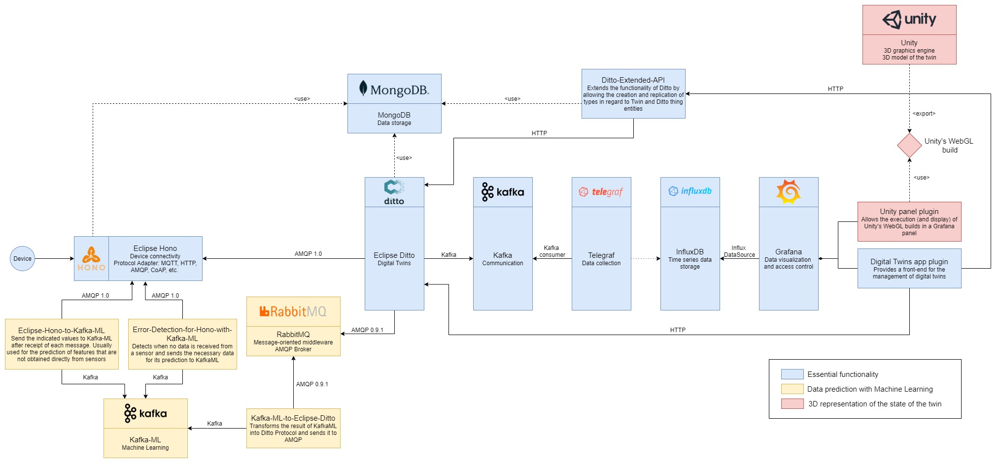

# Digital Twins Platform

This platform has been designed to facilitate the development of digital twins and is characterised by the exclusive use of open source components. The aim is to achieve a platform that covers all the functionalities that a digital twin may require, from the most basic ones, such as simply checking its real-time state, to more advanced ones, such as the inclusion of predicted or simulated data.

This platform is currently **under development**, so its use in production environments is not recommended at this stage.

## Table of Contents
- [Changelog](#changelog)
- [Architecture](#architecture)
- [Deploy platform in a fast way](#deploy-platform-in-a-fast-way)
    - [Requirements to deploy using Helm](#requirements-to-deploy-using-helm)
    - [Steps to deploy platform using Helm](#steps-to-deploy-platform-using-helm)
- [Deploy platform manually](#deploy-platform-manually)
    - [Requirements to deploy manually](#requirements-to-deploy-manually)
    - [Steps to deploy platform manually](#steps-to-deploy-platform-manually)
      - [Deploy Eclipse Ditto and Eclipse Hono](#deploy-eclipse-ditto-and-eclipse-hono)
- [Usage](#usage)
- [Publications](#publications)
- [License](#license)

## Changelog

## Architecture

This platform is built around the [Eclipse Ditto](https://www.eclipse.org/ditto/) digital twin framework. The following image shows the current architecture of the platform, which is intended to be extended over time. Each of the colours represents components that serve a certain functionality. These components are mostly external projects to our organisation, although there are also certain components that have had to be created especially for the platform. The code and documentation for these can be found in their respective repositories, which are all linked in the [components folder](/components).



- The **blue part** represents the base of the platform, as it is made up of components that cover the **basic functionality** of any digital twin platform. It is composed of the following components:
  - [Eclipse Ditto](https://www.eclipse.org/ditto/).
  - [Eclipse Hono](https://www.eclipse.org/hono/).
  - [Apache Kafka](https://kafka.apache.org/). It works as an intermediary between Eclipse Ditto and Telegraf, as they cannot connect directly (they need a component that acts as a broker).
  - [Telegraf](https://www.influxdata.com/time-series-platform/telegraf/). This is the recommended data collector for InfluxDB databases. It is in charge of constantly consuming the given Kafka topic and writing the received messages to the specified InfluxDB database.
  - [InfluxDB](https://www.influxdata.com/products/influxdb-overview/).
  - [Grafana](https://grafana.com/oss/grafana/).
  - [Digital Twins plugin for Grafana](https://github.com/ertis-research/digital-twins-plugin-for-Grafana/).
  - [Extended API for Eclipse Ditto](https://github.com/ertis-research/extended-api-for-Eclipse-Ditto/).
- The **yellow part**...
- The **red part**...

## Deploy platform in a fast way
### Requirements to deploy using Helm
- [Docker](https://www.docker.com/)
- [Kubernetes](https://kubernetes.io/)
- [Helm](https://helm.sh/)

### Steps to deploy platform using Helm
*Currently in development*

## Deploy platform manually
This section will explain how to deploy the platform manually. Basically, you will have to deploy or install the different components and then connect them. The procedure explained below is the one followed to deploy them in **Kubernetes** using in most cases the **Helm** option, but any other installation in which all the components are correctly installed and there is some kind of network between them to be able to communicate can be used.

### Requirements to deploy manually
- [Docker](https://www.docker.com/)
- [Kubernetes](https://kubernetes.io/)
- [Helm](https://helm.sh/)


### Steps to deploy platform manually
We recommend installing all components in the same Kubernetes namespace to make it easier to identify and control them all. In our case the namespace name will be stored in a bash variable called NS.

#### Deploy Eclipse Ditto and Eclipse Hono
To deploy both Eclipse Ditto and Eclipse Hono we will directly install the [cloud2edge package](https://www.eclipse.org/packages/packages/cloud2edge/), which is specially created to allow these two tools to connect correctly.
Before executing the commands we will need to have the files [pv-hono.yaml](files_for_manual_deploy/pv-hono.yaml), [pv-mongodb.yaml](files_for_manual_deploy/pv-mongodb.yaml), [pvc-mongodb.yaml](files_for_manual_deploy/pvc-mongodb.yaml) and [values-cloud2edge.yaml](files_for_manual_deploy/values-cloud2edge.yaml) in the folder where we are in the terminal.
Once ready, and complying with all the [prerequisites](https://www.eclipse.org/packages/prereqs/) of the package, we execute the following commands.
```
helm repo add eclipse-iot https://eclipse.org/packages/charts
helm repo update
kubectl create namespace $NS
kubectl apply -f pv-hono.yaml -n $NS
kubectl apply -f pv-mongodb.yaml -n $NS
kubectl apply -f pvc-mongodb.yaml -n $NS
helm install -n $NS --wait --timeout 15m dt eclipse-iot/cloud2edge --version=0.2.3 -f values-cloud2edge.yaml --dependency-update --debug
```
If all pods are running and ready we already have the first two components installed.

#### Deploy Kafka


#### Deploy InfluxDB
#### Deploy Telegraf

## Usage

## Publications

## License


